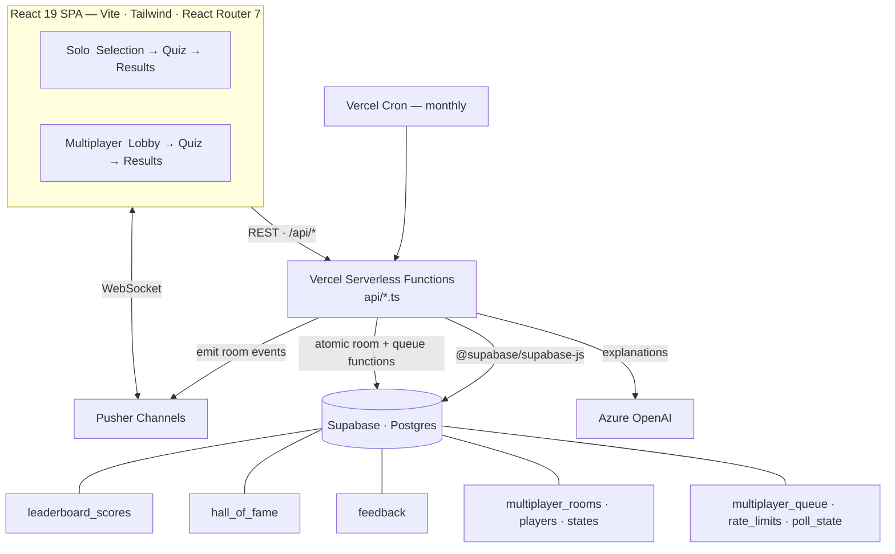

<div align="center">

# 🧮 Math Practice Game

### *A fast, friendly, and ferociously fun way for kids to master mental math.*

Solo drills&nbsp;·&nbsp;live multiplayer&nbsp;·&nbsp;AI opponents&nbsp;·&nbsp;global leaderboards

<br/>

[](https://react.dev)
[](https://www.typescriptlang.org)
[](https://vitejs.dev)
[](https://tailwindcss.com)
[](https://vercel.com)
[](https://supabase.com)
[](https://pusher.com)
[](#-overview)

</div>

---

## 📑 Table of Contents

- [Overview](#-overview)
- [Features](#-features)
- [Tech Stack](#-tech-stack)
- [Architecture](#-architecture)
- [Project Structure](#-project-structure)
- [Getting Started](#-getting-started)
- [Environment Variables](#-environment-variables)
- [Scripts](#-scripts)
- [Database](#-database)
- [Deployment](#-deployment)
- [How It Works](#-how-it-works)
- [Contributing](#-contributing)
- [License](#-license)

---

## ✨ Overview

**Math Practice Game** is an interactive study tool built for kids (and the kid in all of us) to drill the fundamentals — multiplication, division, squares, square roots, signed-number arithmetic, and fraction ↔ decimal ↔ percent conversions — in short, gamified sprints.

Pick a topic, choose your numbers and timer, and race the clock solo. Then bring a friend (or three), spin up an instant room, and battle live — against humans or AI opponents — while monthly leaderboards crown the fastest minds.

> **Tech at a glance:** a React 19 single-page app on Vite, talking to Vercel serverless functions backed by Supabase (Postgres), with real-time multiplayer over Pusher and AI explanations from Azure OpenAI.

> [!NOTE]
> This project is in **beta**. An in-app feedback button (bug / feature) lives on the home screen and writes straight to the database.

---

## 🎮 Features

### 🧠 Nine practice modes

Pick exactly what you want to drill — the question engine handles the rest.

| Category | Modes | Numbers |
|---|---|---|
| **Arithmetic** | Multiplication · Division · Squares · Square Roots · Negative Numbers | 1–12 (squares & roots 1–20, negatives 1–10) |
| **Conversions** | Fraction → Decimal · Decimal → Fraction · Fraction → Percent · Percent → Fraction | curated set (up to 25 questions) |

### ⚡ Solo Quiz

- **Per-number selection** — drill just the 7s and 8s, or the whole table.
- **Custom question counts** — 5–50 questions (default 10).
- **Optional time limit** — 30s / 1m / 2m / 5m / a custom `MM:SS` / or no limit.
- **A genuinely fair timer** — wall-clock based (`performance.now()`), unit-tested against timer drift.
- **AI-generated explanations** — get a friendly, worked walkthrough of any answer you missed.
- **Local progress & personal bests** — an expandable per-operation panel of accuracy, average time, most-practiced numbers, and your best score, saved in your browser.
- **Anti-cheat** — switching or hiding the tab mid-quiz auto-submits your run.

### 🌐 Multiplayer (2–4 players)

- **Quick Match** — instant 1v1 matchmaking by operation.
- **Private rooms** — shareable 8-character codes and `/join/:code` invite links.
- **Free-for-all or 2v2 teams** — the host picks the mode and can shuffle or reassign players.
- **AI opponents** — four difficulty tiers: `easy` · `medium` · `hard` · `expert`.
- **Live race view** — see opponents' progress and finish times as they happen.
- **Ready-up & rematch** — synchronized countdowns and one-tap rematches.
- **Identical question sets** — everyone races the exact same quiz, so it's a fair fight.

### 🏆 Leaderboards & Hall of Fame

- **Per-operation monthly leaderboards** — top 5 per mode, reset on Eastern-time month boundaries.
- **Golf-style scoring** — faster is better; the lowest time-based score wins.
- **Strict eligibility** — only a perfect run on exactly 10 questions with all numbers selected qualifies, so the board stays meaningful.
- **Hall of Fame** — a monthly cron snapshots each month's champions; browse past winners by year and month.

### 🎨 Polish

- **Light / dark theme** — toggle anywhere, override via `?theme=dark|light`, persisted to `localStorage`.
- **Custom animations** — pop-in, fade-in, and word-pulse keyframes for snappy feedback.
- **Analytics** — Vercel Analytics + Speed Insights, plus optional Google Analytics (respects Do-Not-Track).
- **In-app beta feedback** — report a bug or request a feature without leaving the game.

### 📣 Admin announcements

- **Global broadcast banner** — an admin can push a short announcement that appears in real time, pinned to the top of the screen for **every** connected player, then auto-dismisses after a few seconds.
- **Server-authorized** — the broadcast endpoint ([`api/broadcast.ts`](api/broadcast.ts)) verifies an admin code **server-side** before emitting and is per-IP rate limited, so the privileged action isn't gated by the UI alone.
- **Configurable codes** — authorized codes come from the `ADMIN_CODES` environment variable (comma-separated), with a built-in fallback so the feature works out of the box.

<p align="right"><a href="#-math-practice-game">⬆ Back to top</a></p>

---

## 🧰 Tech Stack

| Layer | Technology |
|---|---|
| **Frontend** | [React 19](https://react.dev), [TypeScript 6](https://www.typescriptlang.org), [Vite 8](https://vitejs.dev), [React Router 7](https://reactrouter.com), [Tailwind CSS 4](https://tailwindcss.com) (CSS-first config via PostCSS) |
| **Realtime** | [Pusher Channels](https://pusher.com/channels) — `pusher-js` on the client, `pusher` SDK on the server |
| **Backend** | [Vercel Serverless Functions](https://vercel.com/docs/functions) (`@vercel/node`); [Express 5](https://expressjs.com) for the local dev API only |
| **Database** | [Supabase](https://supabase.com) / Postgres via `@supabase/supabase-js` |
| **AI** | [Azure OpenAI](https://azure.microsoft.com/products/ai-services/openai-service) (`@azure/openai`) for answer explanations |
| **Validation** | [Zod](https://zod.dev) schemas at the API boundary |
| **Dates** | [Luxon](https://moment.github.io/luxon/) — leaderboard months use `America/New_York` |
| **Analytics** | `@vercel/analytics`, `@vercel/speed-insights`, optional Google Analytics (gtag) |
| **Testing** | [Vitest](https://vitest.dev) + [Testing Library](https://testing-library.com/) on `jsdom`, with V8 coverage |
| **Tooling** | ESLint 9 (flat config), Prettier |

<p align="right"><a href="#-math-practice-game">⬆ Back to top</a></p>

---

## 📐 Architecture



**How the pieces talk:**

- The **client** is a pure SPA. Solo play keeps all state in React; multiplayer state is coordinated through a `MultiplayerContext`.
- **REST** calls hit serverless functions under `/api/*` for scores, leaderboards, feedback, explanations, and every multiplayer action.
- **Pusher** carries real-time room events (player joined, progress, finished, game ended, rematch…) over WebSockets.
- A separate **global broadcast channel** (`global-broadcast`) delivers admin announcements to every connected client.
- **Multiplayer state lives in Supabase Postgres** (`room-store.ts` calls atomic `mp_*` SQL functions), so every serverless instance shares one source of truth — rooms still expire after ~1 hour. The quick-match queue, rate limits, and the active-poll snapshot are stored the same way, so nothing critical lives in per-instance lambda memory.
- A **monthly Vercel cron** promotes each month's leaderboard winners into the Hall of Fame and prunes old scores.

<p align="right"><a href="#-math-practice-game">⬆ Back to top</a></p>

---

## 📁 Project Structure

```text
.
├─ index.html                  # Entry HTML — Inter font, meta/OG/Twitter tags
├─ src/                        # React client
│  ├─ App.tsx                  # Providers + router + global solo state
│  ├─ index.tsx                # React root
│  ├─ index.css                # Tailwind v4 CSS-first config + custom keyframe animations
│  ├─ components/
│  │  ├─ screens/              # Selection, Quiz, Results (solo + multiplayer), Admin
│  │  │  └─ multiplayer-lobby/ # Lobby home, create/join/quick-match/AI flows
│  │  ├─ leaderboard/          # Global leaderboard, Hall of Fame, progress & personal bests
│  │  └─ ui/                   # Buttons, icons, toast, feedback, ad card, admin panel + broadcast banner
│  ├─ contexts/                # ThemeContext, MultiplayerContext, AdminContext
│  ├─ hooks/                   # useQuizTimer, usePusherChannel, useTheme, …
│  └─ lib/                     # operations, audio, ga, logger, feedbackMessages, multiplayer
├─ api/                        # Vercel serverless functions
│  ├─ submit-score.ts          # Validate + store an eligible leaderboard score
│  ├─ check-score.ts           # Is this run a top-5 score this month?
│  ├─ get-leaderboard.ts       # Top 5 for an operation (current month)
│  ├─ get-hall-of-fame.ts      # Champions for an operation/year/month
│  ├─ get-hall-of-fame-dates.ts# Which year/month buckets have data
│  ├─ archive-scores.ts        # Monthly cron → Hall of Fame + pruning
│  ├─ get-explanation.ts       # Azure OpenAI answer explanations
│  ├─ submit-feedback.ts       # Store beta feedback
│  ├─ multiplayer.ts           # All room actions (create/join/start/answer/finish…)
│  ├─ broadcast.ts             # Admin → global announcement banner (Pusher)
│  ├─ poll.ts                  # Admin live polls (start/vote/close)
│  └─ pusher-auth.ts           # Authorize private/presence channels
├─ lib/api/                    # Shared server modules
│  ├─ db-pool.ts               # Supabase client (service role)
│  ├─ pusher.ts                # Pusher server SDK + room-code helpers
│  ├─ room-store.ts            # Supabase-backed room store (atomic mp_* functions)
│  ├─ game-results.ts          # Pure multiplayer ranking + team results
│  ├─ ai-player.ts             # AI opponent profiles (easy → expert)
│  ├─ score-eligibility.ts     # Leaderboard eligibility rules
│  ├─ validation.ts            # Zod schemas for every endpoint
│  ├─ profanity.ts             # Player-name profanity filter
│  ├─ time-utils.ts            # Luxon — Eastern-time month boundaries
│  ├─ rate-limit.ts            # Postgres-backed rate limiter (fails open)
│  ├─ admin-auth.ts            # Admin-code validation (broadcast / polls)
│  ├─ errors.ts                # ApiError + shared error handling
│  ├─ logger.ts                # Server logger (silences debug logs in prod)
│  └─ constants.ts             # Allowed operations
├─ shared/                     # Single source of truth shared by client + API
│  ├─ types.ts                 # Shared TypeScript contracts (Operation, Room, …)
│  ├─ questions.ts             # Shared question-generation logic
│  └─ conversions.ts           # Shared fraction/decimal/percent conversion table
├─ migrations/                 # SQL — see migrations/README.md
│  ├─ schema/                  # Current Supabase schema (apply these)
│  ├─ archive/                 # Point-in-time month archives (auditability)
│  └─ legacy-azure/            # Old Azure SQL scripts (historical only)
├─ server-dev.ts               # Local Express dev API (mirrors Vercel routes)
├─ vite.config.ts              # Vite + dev proxy (/api → :3001)
└─ vercel.json                 # Functions config + monthly cron
```

> **Single source of truth:** every shared shape — `Operation`, `Question`, `Room`, `Player`, `Team`, `MultiplayerResult`, `RoomEvent`, … — lives in [`shared/types.ts`](shared/types.ts) and is imported by both the client and the API, so the contract never drifts.

<p align="right"><a href="#-math-practice-game">⬆ Back to top</a></p>

---

## 🚀 Getting Started

### Prerequisites

- **Node.js 20+**
- A free [**Supabase**](https://supabase.com) project (Postgres database)
- A free [**Pusher Channels**](https://pusher.com/channels) app (real-time multiplayer)
- *(Optional)* an **Azure OpenAI** resource — only needed for AI answer explanations

### 1. Clone & install

```powershell
git clone https://github.com/your-username/Math-Practice-Game.git
cd Math-Practice-Game
npm install
```

### 2. Configure environment

Copy the example file and fill in your values. The local dev API loads **`.env.local`**:

```powershell
Copy-Item .env.example .env.local
```

See [Environment Variables](#-environment-variables) for the full reference.

### 3. Set up the database

In your Supabase project's **SQL Editor**, run the schema files in order (they're idempotent and safe to re-run):

1. [`migrations/schema/supabase-schema.sql`](migrations/schema/supabase-schema.sql) — `leaderboard_scores` + `hall_of_fame` (with RLS)
2. [`migrations/schema/feedback-table.sql`](migrations/schema/feedback-table.sql) — `feedback`
3. [`migrations/schema/multiplayer-tables.sql`](migrations/schema/multiplayer-tables.sql) — multiplayer rooms, players, states, quick-match queue, rate limits, polls (with RLS)
4. [`migrations/schema/multiplayer-functions.sql`](migrations/schema/multiplayer-functions.sql) — the atomic `mp_*` room functions (run after the tables)
5. *(optional)* [`migrations/schema/multiplayer-cron.sql`](migrations/schema/multiplayer-cron.sql) — schedule room cleanup via pg_cron

### 4. Run it

```powershell
# Client + dev API together (recommended)
npm start

# …or run them separately
npm run dev      # client only  → http://localhost:5173
npm run dev:api  # dev API only → http://localhost:3001
```

Vite proxies `/api` requests to the dev API on port `3001`, so the front end "just works" against your local functions.

### 5. Build for production

```powershell
npm run build    # production bundle → dist/
npm run preview  # serve the built bundle locally
```

<p align="right"><a href="#-math-practice-game">⬆ Back to top</a></p>

---

## 🔐 Environment Variables

`.env.example` covers the core multiplayer + database setup. Variables **without** the `VITE_` prefix are server-only; `VITE_`-prefixed variables are exposed to the browser bundle.

<details>
<summary><strong>Full variable reference</strong></summary>

<br/>

**Server-side (Functions / dev API)**

| Variable | Required | Purpose |
|---|---|---|
| `SUPABASE_URL` | ✅ | Supabase project URL |
| `SUPABASE_SERVICE_ROLE_KEY` | ✅ | Service-role key (server-only; bypasses RLS) |
| `PUSHER_APP_ID` | ✅ | Pusher app id |
| `PUSHER_KEY` | ✅ | Pusher key |
| `PUSHER_SECRET` | ✅ | Pusher secret |
| `PUSHER_CLUSTER` | ✅ | Pusher cluster (e.g. `us2`) |
| `AZURE_API_KEY` | optional | Azure OpenAI key — enables explanations *(also accepts `AZURE_OPENAI_API_KEY`)* |
| `AZURE_ENDPOINT` | optional | Azure OpenAI endpoint *(also accepts `AZURE_OPENAI_ENDPOINT`)* |
| `AZURE_DEPLOYMENT_NAME` | optional | Azure deployment name *(also accepts `AZURE_OPENAI_DEPLOYMENT_NAME`)* |
| `CRON_SECRET` | prod | Bearer token that protects the monthly archive cron endpoint |
| `BASE_URL` | optional | Base URL for server-side fetches (defaults to localhost) |
| `ADMIN_CODES` | optional | Comma-separated admin codes that authorize the broadcast endpoint *(falls back to built-in codes if unset)* |

**Client-side (Vite — exposed to the browser)**

| Variable | Required | Purpose |
|---|---|---|
| `VITE_PUSHER_KEY` | ✅ | Pusher key for the browser client |
| `VITE_PUSHER_CLUSTER` | ✅ | Pusher cluster for the browser client |
| `VITE_GA_ID` | optional | Google Analytics measurement id |

</details>

<p align="right"><a href="#-math-practice-game">⬆ Back to top</a></p>

---

## 📜 Scripts

| Script | Command | What it does |
|---|---|---|
| `npm start` | `concurrently … vite + tsx watch` | Run the client **and** dev API together |
| `npm run dev` | `vite` | Client only → http://localhost:5173 |
| `npm run dev:api` | `tsx watch server-dev.ts` | Local Express API → http://localhost:3001 |
| `npm run dev:test` | `cross-env VITE_NODE_ENV=test vite` | Client in test mode (exposes a finish-quiz test hook) |
| `npm run build` | `vite build` | Production bundle → `dist/` |
| `npm run preview` | `vite preview` | Serve the production build locally |
| `npm run typecheck` | `tsc --noEmit` | Full TypeScript type-check |
| `npm run lint` | `eslint …` | Lint the project (**blocking in CI**; warnings are shown) |
| `npm test` | `vitest run` | Run the test suite once |
| `npm run test:watch` | `vitest` | Run tests in watch mode |
| `npm run test:coverage` | `vitest run --coverage` | Run the suite with a V8 coverage report |
| `npm run format` | `prettier --write .` | Format the whole project |
| `npm run format:check` | `prettier --check .` | Check formatting without writing |

> **Note:** `build` runs `vite build` only — type-checking is the separate `typecheck` script (CI runs both).

<p align="right"><a href="#-math-practice-game">⬆ Back to top</a></p>

---

## 💾 Database

Postgres tables, all with Row Level Security enabled. The leaderboard and feedback tables allow public reads; the multiplayer tables are server-only (all access goes through the service-role key).

| Table | Purpose |
|---|---|
| `leaderboard_scores` | The current month's live scores, per operation. Lower score = faster = better. |
| `hall_of_fame` | Archived monthly champions — one winner per operation per month (enforced by a unique index). |
| `feedback` | Beta feedback submissions (bug / feature). |
| `multiplayer_rooms` (+ `multiplayer_players`, `multiplayer_player_states`) | Live multiplayer rooms and per-player game state, mutated by atomic `mp_*` functions. Expire after ~1 hour. |
| `multiplayer_queue` | Quick-match waiting list. |
| `rate_limits` · `poll_state` | Shared rate-limit counters and the active admin-poll snapshot. |

Schema, indexes, and RLS policies live in [`migrations/schema/`](migrations/schema). See [`migrations/README.md`](migrations/README.md) for how to apply them and for notes on the `archive/` and `legacy-azure/` folders.

> **History:** this app originally ran on **Azure SQL** (the `legacy-azure/` scripts are kept for reference) and has since migrated to **Supabase / Postgres**. Live multiplayer state — rooms, players, the quick-match queue, rate limits, and polls — also moved **out of per-lambda memory into Postgres** (mutated by atomic `mp_*` functions), so every serverless instance shares one source of truth and large rooms stay consistent. Azure OpenAI is still used — but only for answer explanations, not for data.

<p align="right"><a href="#-math-practice-game">⬆ Back to top</a></p>

---

## 🚢 Deployment

The app is wired for **Vercel** out of the box. [`vercel.json`](vercel.json) declares:

- **Serverless functions** for `api/**/*.ts` (1 GB memory), bundling the shared `lib/api/**` and `shared/**` modules. The `archive-scores` function gets an extended 60-second `maxDuration`.
- **SPA rewrite** — every non-`/api`, non-`/assets` path falls through to `index.html`.
- **Monthly cron** — `0 5 1 * *` (05:00 UTC on the 1st) hits `/api/archive-scores` to snapshot the Hall of Fame. The endpoint is protected by `CRON_SECRET`.

**To deploy:** push to GitHub, import the repo into Vercel, set the environment variables above, and you're live.

**Continuous integration:** [`.github/workflows/ci.yml`](.github/workflows/ci.yml) runs `typecheck`, `lint` (blocking), `test` with coverage, and `build` on every push and PR. A backup [`archive-scores-cron.yml`](.github/workflows/archive-scores-cron.yml) workflow provides a redundant monthly archive trigger.

<p align="right"><a href="#-math-practice-game">⬆ Back to top</a></p>

---

## 🧠 How It Works

A few details worth knowing if you're poking around the code:

- **Fair timing.** Quizzes time with the wall clock (`performance.now()`), not an accumulating `setInterval` counter — so the clock stays accurate even when the browser throttles timers. This is locked in by [`src/__tests__/timer-fairness.test.ts`](src/__tests__/timer-fairness.test.ts), which even asserts the quiz screens don't reintroduce the old drifting pattern.
- **Tested core.** A Vitest suite covers the logic-heavy pieces — question generation, conversions, score eligibility, Zod validation, Eastern-time month boundaries, the profanity filter, AI profiles, multiplayer results ranking, and the `useQuizTimer` hook (the last via Testing Library on `jsdom`). The room store itself is exercised by an opt-in integration suite that runs against a real Supabase instance when credentials are present. CI runs it with a V8 coverage floor so coverage can't slide backwards.
- **Anti-cheat.** Hiding or switching away from the tab mid-quiz auto-submits your answers, in both solo and multiplayer.
- **Leaderboard integrity.** A score only counts if it's a perfect run on exactly 10 questions with all numbers selected (enforced server-side in `score-eligibility.ts`). Player names are profanity-filtered.
- **Eastern-time months.** Leaderboards roll over on `America/New_York` month boundaries (via Luxon), and the monthly cron archives the previous month's winners.
- **Shared room state.** Multiplayer rooms, the quick-match queue, rate limits, and the live poll all live in Supabase Postgres, mutated through atomic `mp_*` functions so concurrent players — and serverless instances — never disagree (this is what makes large tournament rooms safe). Rooms expire after ~1 hour and a scheduled cleanup prunes stale rows.
- **AI games don't touch the room store.** A match against the AI bot is scored entirely in the browser (the opponent is simulated client-side), so it never creates a multiplayer room, player, or state row in Supabase — there's nothing to persist or clean up. Only human-vs-human play uses the database.
- **Validated boundaries.** Every API request is validated with Zod before it touches the database, and errors flow through a single `ApiError` handler.
- **Admin broadcasts.** A code-gated endpoint (`api/broadcast.ts`) lets an admin push a short announcement to all players over a global Pusher channel. Authorization happens **server-side** (against `ADMIN_CODES`) and is per-IP rate limited.

<p align="right"><a href="#-math-practice-game">⬆ Back to top</a></p>

---

## 🤝 Contributing

PRs welcome! A few house rules:

- **TypeScript strict mode** is on — share any cross-runtime types via [`shared/types.ts`](shared/types.ts).
- **Keep CI green:** `npm run typecheck`, `npm run lint`, and `npm run test:coverage` should all pass.
- **Tailwind utility classes** for styling; custom animations belong in [`src/index.css`](src/index.css).
- **Don't change the cron** in [`vercel.json`](vercel.json) without updating the archive logic in [`api/archive-scores.ts`](api/archive-scores.ts).
- Run `npm run format` before committing.

<p align="right"><a href="#-math-practice-game">⬆ Back to top</a></p>

---

## 📄 License

Private / educational project. If you plan to open-source it, add a `LICENSE` file (e.g. MIT) to make the terms explicit.

---

<div align="center">

**Made with ❤️ for kids who'd rather race a robot than do a worksheet.**

</div>
